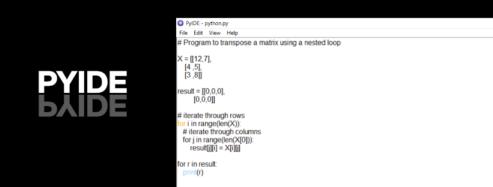

  
  

## Getting Started

1. Fork this project into your github repo 
2. Clone project into local computer 
3. Start using it and Enjoy.

## Version
* v1.2

## Want to contribution ?
* We welcome everyone to contribute on this project
### To contribute
1. Fork this project
2. Clone onto your local computer
3. debug code or add features or anything you want to add
4. Send the pull request

## Contributors
[RafDiol](https://github.com/RafDiol)
## Authors
Jaspreet Singh

### Contact me ?
* LinkedIn - https://www.linkedin.com/in/jaspreetsidhu13/
* GitHub - https://github.com/jaspreetsidhu3 
